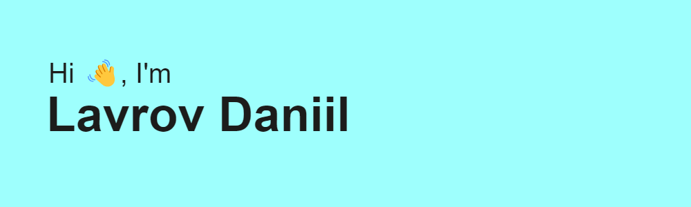

  
  

  

---

## :man_technologist: About Me :

- I am a beginner Web-Developer  from Russia.
- Student of the school No. 24 in Taganrog
- Participated and won in hackathons
- In my free time I study Front-end

---

### :desktop_computer: My stack :

---

### :fire: My Stats :

  <h2>🐍 My Contributions 🐍</h2>
  

